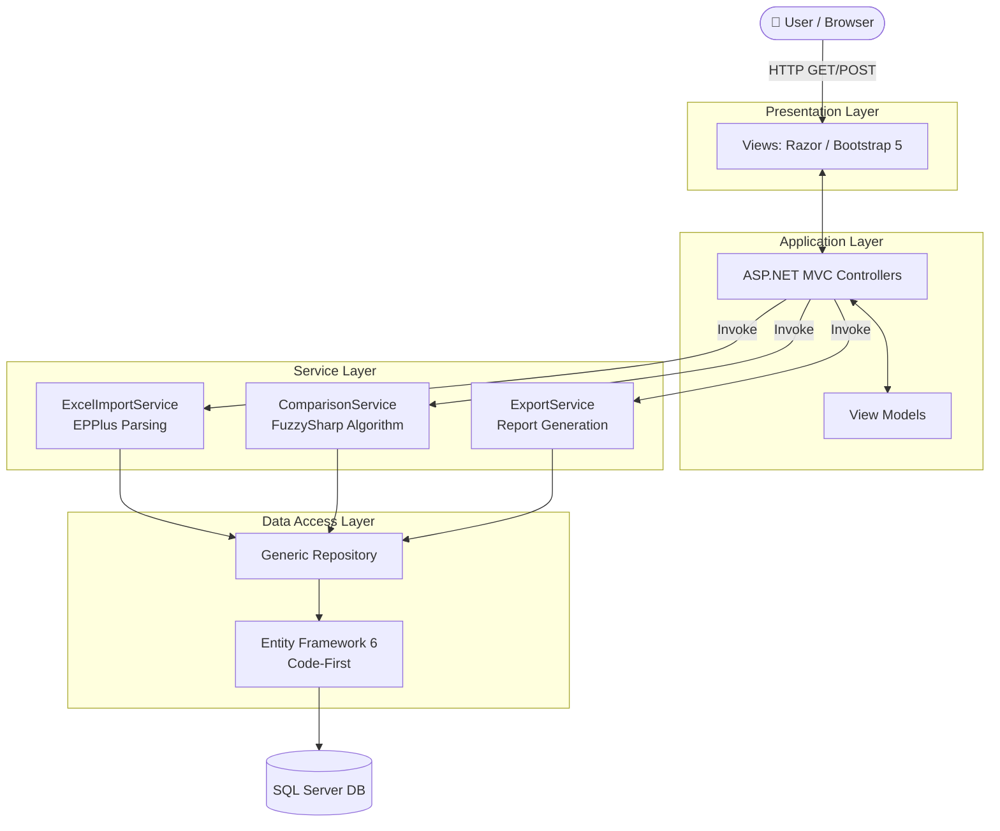
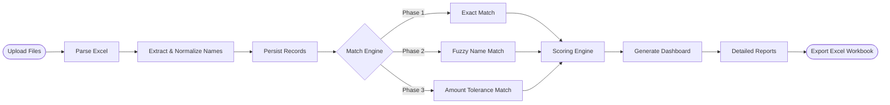

<div align="center">

# 🏦 GST RERA Reconciliation System

**Enterprise Financial Reconciliation Web Application**

[](#)
[](#)
[](#)
[](#)
[](#)

*An intelligent platform automating the comparison of RERA bank statements against GST records using fuzzy logic and multi-stage scoring.*

</div>

---

## 📖 Problem Statement

In the real estate and infrastructure sectors, organizations are required to strictly monitor funds deposited into **RERA (Real Estate Regulatory Authority)** bank accounts and correctly reflect these transactions in their **GST (Goods and Services Tax)** filings.

Manually reconciling hundreds or thousands of transactions across disjointed datasets is fundamentally flawed. Businesses face significant challenges:
- **Name Variations:** The same entity may be recorded as "ABC Builders Pvt Ltd" in bank statements, but "ABC Builders Private Limited" in tax returns.
- **Data Volume:** Processing thousands of lines of transactional data requires significant human capital.
- **Reporting Inconsistencies:** Even minor misspellings or cent-level discrepancies can disrupt compliance workflows.
- **Missing Records:** Tracking which deposits have bypassed tax filings (or vice versa) is error-prone.

---

## 💡 Solution Overview

The **GST RERA Reconciliation System** transforms a tedious manual process into a streamlined, automated pipeline. By uploading raw Excel bank statements, the platform automatically parses the data, extracts vendor/customer names from complex transaction descriptions, and runs a sophisticated **multi-stage matching algorithm**.

The system classifies every transaction into one of six distinct categories, enabling financial auditors to instantly identify anomalies, export curated analytical reports, and maintain an immutable historical record of upload sessions.

---

## ✨ Key Features

- **Intelligent Excel Parsing:** Automatically detects data bounds and extracts pertinent transaction details while stripping away irrelevant bank headers.
- **Smart Name Extraction:** Isolates real customer names from cluttered transaction descriptions (e.g., extracting "JOHN DOE" from "NEFT CR-SBIN00001-JOHN DOE").
- **Multi-Stage Match Engine:** Employs exact matching, fuzzy string similarity (via `FuzzySharp`), and amount-based tolerances to achieve unparalleled matching accuracy.
- **Advanced Scoring:** Computes confidence scores combining string distance metrics and numeric variances.
- **Interactive Analytics Dashboard:** Real-time KPIs, progress indicators, and proportional breakdown widgets.
- **Comprehensive Reporting:** 7 distinct report tabs equipped with server-side pagination, sorting, and text searching.
- **Enterprise Excel Export:** Generates multi-sheet, color-coded workbooks complete with formulas and summary dashboards.
- **Session-Based Isolation:** Maintains separate reconciliation runs concurrently without data bleed.

---

## 🏗️ System Architecture

The application adheres to a clean, **Layered Architecture (N-Tier)** ensuring separation of concerns, maintainability, and scalability.



---

## 🔄 Application Workflow



---

## 🛠️ Technology Stack

| Component | Technology | Description |
|-----------|------------|-------------|
| **Framework** | ASP.NET MVC 5 | Core web framework providing routing, controllers, and server-side rendering. |
| **Language** | C# (v7.3) | Backend business logic and OOP modeling. |
| **ORM** | Entity Framework 6 | Code-First database migrations and LINQ querying. |
| **Database** | SQL Server | Relational data persistence and transaction management. |
| **UI Framework** | Bootstrap 5.3 | Responsive grid, components, and utility classes. |
| **Excel I/O** | EPPlus | High-performance Excel reading/writing via OpenXML. |
| **Algorithms** | FuzzySharp | Levenshtein distance string matching (`WeightedRatio`). |
| **Frontend** | jQuery & Razor | Client-side interactions and dynamic view generation. |

---

## 🗄️ Database Design

The database employs referential integrity with cascading deletes bounded by `UploadSessions`.

### Entities

1. **`UploadSession`**
   - Tracks individual reconciliation runs.
   - *Columns:* `Id`, `UploadDate`.
2. **`RERARecord`**
   - Individual deposits from the RERA bank statement.
   - *Columns:* `Id`, `SessionId` (FK), `Name`, `Amount`.
3. **`GSTRecord`**
   - Filed transactions from the GST return.
   - *Columns:* `Id`, `SessionId` (FK), `Name`, `GSTAmount`.
4. **`ComparisonResult`**
   - The computed output of the match engine linking RERA to GST.
   - *Columns:* `Id`, `SessionId` (FK), `RERAName`, `GSTName`, `ExpectedGST`, `ActualGST`, `NameScore`, `AmountScore`, `FinalScore`, `Status`.

---

## 🧠 Reconciliation Logic

The core value proposition of the system lies in `ComparisonService.cs`, which processes data via a 3-tier algorithm.

### 1. Exact Matching
The engine builds an `O(1)` Hash Dictionary using normalized names (`Trim().ToUpper()`). If a name precisely matches, the amount is checked. 
- *Perfect Amount Match:* Flagged as **MATCHED**.
- *Amount Variance:* Flagged as **GST MISMATCH**.

### 2. Fuzzy Matching
For remaining unmatched records, the engine calculates string similarity against all potential candidates using **FuzzySharp's `WeightedRatio`**.
- *Score ≥ 90 + Low Amount Variance:* Flagged as **LIKELY MATCH**.
- *Score ≥ 80:* Flagged as **POSSIBLE MATCH** (requires human review).

### 3. Amount-Based Matching
As a final pass, if the strings are vastly different but the exact financial amounts match within a `₹1.00` tolerance, the records are associated as a **LIKELY MATCH**.

### 📊 Match Score Calculation
```csharp
// String similarity ratio via FuzzySharp (0-100)
NameScore = Fuzz.WeightedRatio(reraName, gstName);

// Amount variance ratio
AmountScore = Max(0, 100 - (|Expected - Actual| / Max(Expected, 1) * 100));

// Weighted composite
FinalScore = (NameScore * 0.6) + (AmountScore * 0.4);
```

---

## 📈 Analytics Dashboard

The dashboard provides executives and auditors with an immediate snapshot of the reconciliation session:
- **KPI Metrics:** Total RERA Records, Total GST Records, Aggregate Match Rate (%), and Total GST Difference (₹).
- **Status Cards:** Individual counters for all 6 matching categories.
- **Progress Bar:** A proportional, color-coded visual representation of data distribution.
- **Session Filter:** Ability to dynamically switch views between historical uploads.

---

## 📑 Reports Module

The detailed reports interface is split into categorical tabs for focused auditing:
- **All Records:** Complete view of the session.
- **Matched:** Perfect executions.
- **Likely Match:** System-confident fuzzy associations.
- **Possible Match:** Partial name associations requiring human verification.
- **GST Mismatch:** Same entity, divergent tax figures.
- **Missing in GST:** Funds hit the RERA account, but no tax was filed.
- **Missing in RERA:** Tax was filed, but funds never reached the RERA account.

*Includes robust server-side sorting (via EF `OrderBy`), pagination (`Skip/Take`), and global searching (`Contains`).*

---

## 📸 Screenshots


<details>
<summary><b>Click to expand Screenshots</b></summary>

| Dashboard Analytics | File Upload Interface |
|:---:|:---:|
|  |  |

| Reports Module | Exported Excel Analysis |
|:---:|:---:|
|  |  |

</details>

---

## 🚀 Installation Guide

Follow these steps to deploy the application on your local development environment.

1. **Clone the repository:**
   ```bash
   git clone https://github.com/yourusername/GSTReraReconciliation.git
   cd GSTReraReconciliation
   ```

2. **Restore NuGet Packages:**
   Open `GSTReraReconciliation.sln` in Visual Studio and allow NuGet Package Manager to restore missing dependencies, or run:
   ```powershell
   Update-Package -reinstall
   ```

3. **Configure SQL Server:**
   Ensure SQL Server (Express or Developer) is running locally.

4. **Update Connection String:**
   Open `Web.config` and modify the `<connectionStrings>` node to point to your instance:
   ```xml
   <add name="ReconciliationDb" connectionString="Data Source=localhost;Initial Catalog=GSTReraReconciliationDb;Integrated Security=True;" providerName="System.Data.SqlClient" />
   ```

5. **Run Database Migrations:**
   Open the **Package Manager Console** in Visual Studio and execute:
   ```powershell
   Update-Database
   ```

6. **Build Solution:**
   Press `Ctrl + Shift + B` to compile the solution. Ensure there are 0 errors.

7. **Run the Application:**
   Press `F5` to launch IIS Express and open the application in your default browser.

---

## ⚙️ Configuration

- **Upload Directory:** Excel files are temporarily stored in `~/App_Data/Uploads/` using cryptographically secure UUIDs to prevent directory traversal and file execution vulnerabilities.
- **File Size Limits:** Configured in `Web.config` via `maxRequestLength` (default limit: 10MB).

---

## 📂 Project Structure

```text
GSTReraReconciliation/
├── App_Data/                # Database files and secure file uploads
├── App_Start/               # MVC Routing and Bundle configurations
├── Controllers/             # MVC endpoint controllers
├── Content/                 # CSS (Bootstrap overrides)
├── Data/                    # EF DbContext and Repositories
├── Models/                  # Entity Framework domain models
├── Services/                # Core business logic (Comparison, EPPlus)
├── ViewModels/              # Strongly-typed data transfer objects for UI
├── Views/                   # Razor HTML templates (.cshtml)
└── Scripts/                 # Client-side validation and jQuery
```

---

## 🔮 Future Enhancements

The platform is designed with extensibility in mind. Planned roadmap features include:
- [ ] **AI-Powered Matching:** Implementing NLP transformers to train a proprietary ML model on historical reconciliations.
- [ ] **OCR Bank Statement Processing:** Integrating Tesseract to read scanned PDF bank statements.
- [ ] **Multi-Bank Support:** Dynamic mapping UI to handle varying CSV/Excel column layouts across different financial institutions.
- [ ] **Audit Trail:** Immutable logging of user actions and manual review overrides.
- [ ] **User Authentication:** ASP.NET Identity implementation with Role-Based Access Control (RBAC).

---

## 🎓 Learning Outcomes

This project demonstrates proficiency in several advanced software engineering paradigms:
- **Algorithm Design:** Building optimized fuzzy-logic and heuristic matching engines.
- **Design Patterns:** Implementing the Repository pattern, Service pattern, and Dependency Injection principles within an MVC lifecycle.
- **Data Processing:** Handling volatile, real-world data (raw bank statements) gracefully via data normalization pipelines.
- **Performance Optimization:** Offloading database constraints, utilizing server-side pagination, and employing `O(1)` hash map lookups.

---

## 👤 Author

**Software Engineer**  
*Building enterprise-grade financial technology solutions.*

- GitHub: [@rohanG2607](https://github.com/rohanG2607)
- LinkedIn: [Rohan Gupta](https://linkedin.com/in/rohan-gupta2607)

---

## 📄 License

This project is licensed under the MIT License - see the [LICENSE](LICENSE) file for details.

```text
MIT License

Copyright (c) 2026

Permission is hereby granted, free of charge, to any person obtaining a copy
...
```
